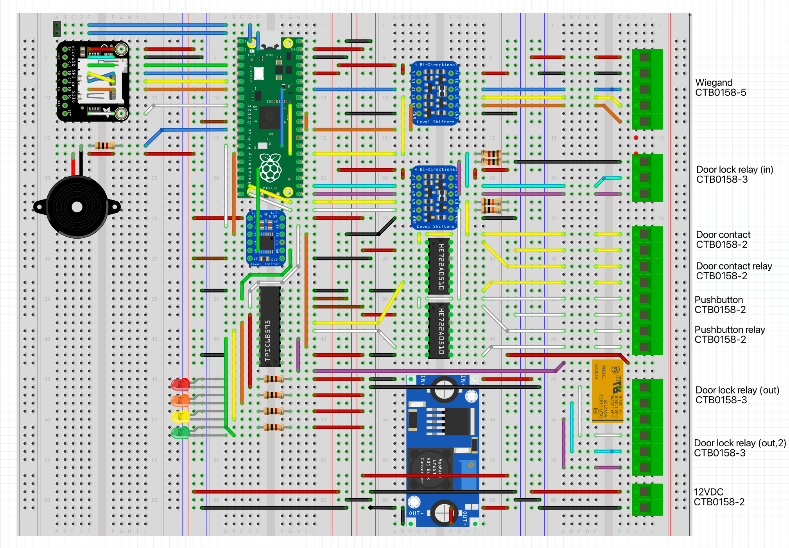

# uhppoted-wiegand

`uhppoted-wiegand` implements a _Raspberry Pi Pico_ reader/emulator for a Wiegand-26 interface.

The project is **mostly** a just-for-fun exploration of the capabilities of the RP2040 PIO but could also 
be useful as a basis for:

- testing and debugging
- interfacing non-standard/off-brand readers and keypads to the UHPPOTE L0x access controllers

The project includes:
- PIO based Wiegand-26 reader emulator which can write a Wiegand-26 card out to a controller
- PIO based Wiegand-26 controller emulator which can read from Wiegand-26 reader and unlock a door
- PIO based Wiegand-26 'universal' reader/writer implementation

## Raison d'être

The RP2040 PIO is an intriguing peripheral and this project was an excuse to explore its capabilities and
limitations. Wiegand-26 is particularly simple protocol and does not even begin to push the boundaries of
the PIO but the code and associated information may be useful for other things.

## Status

Breadboarded and Fritzing'ed implementations of:
- Wiegand-26 reader emulator
- Wiegand-26 controller emulator
- Wiegand-26 'universal' reader/writer

Next up:
- Wiegand-26 relay
- (maybe) KiCad schematics

 

## Release Notes

### Current Release

**[v0.8.9](https://github.com/uhppoted/uhppoted-wiegand/releases/tag/v0.8.9) - 2024-09-06**

1. Maintenance release


## Development

### Building from source

Required tools:
- [Raspberry Pi Pico C/C++ SDK](https://datasheets.raspberrypi.com/pico/raspberry-pi-pico-c-sdk.pdf)
- Compatible C/C++ compiler
- _make_
- [PicoProbe](https://github.com/raspberrypi/picoprobe) (optional but recommended)
- [OpenOCD](https://github.com/raspberrypi/openocd.git) (optional but recommended)
- [PicoTool](https://github.com/raspberrypi/picotool) (optional but recommended)

To build using the included _Makefile_:
```
git clone https://github.com/uhppoted/uhppoted-wiegand.git
cd uhppoted-wiegand/pico
make clean
make build
```

The `build` target produces both a UF2 and an ELF binary for installation on a _Raspberry Pi Pico_ using either:
- USB (using _BOOTSEL_)
- _PicoProbe_ + _OpenOCD_
- _PicoTool_

- The `make install` command installs the binary using _PicoTool_
- The `make run` command installs the binary using _PicoProbe_ and _OpenOCD_

#### Dependencies

| *Dependency*                                                    | *Description*                       |
| --------------------------------------------------------------- | ----------------------------------- |
|                                                                 |                                     |
|                                                                 |                                     |

## Usage

The provided software includes a **very** bare bones serial port command interface. Commands are (currently)
single letter mnemonics and need to be terminated by a carriage return and/or line feed.

The supported command set comprises:

| *Command*                | *Mode*       | *Description*                             |
| -------------------------|--------------|-------------------------------------------|
| TIME yyyy-mm-dd HH:mm:ss | _ALL_        | Set date/time                             |
| CARD nnnnnnnn            | _emulator_   | Emulates card swipe                       |
| CODE dddddd              | _emulator_   | Emulates keypad                           |
|                          |              |                                           |
| LIST ACL                 | _controller_ | List cards in ACL                         |
| CLEAR ACL                | _controller_ | Deletes all cards in ACL                  |
| GRANT nnnnnn dddddd      | _controller_ | Grant card (+ optional PIN) access rights |
| REVOKE nnnnnn            | _controller_ | Revoke card access rights                 |
| QUERY                    | _controller_ | Display last card read/write              |
|                          |              |                                           |
| MOUNT                    | _ALL_        | Mount SD card                             |
| UNMOUNT                  | _ALL_        | Unmount SD card                           |
| FORMAT                   | _ALL_        | Format SD card                            |
|                          |              |                                           |
| UNLOCK                   | _controller_ | Unlocks door for 5 seconds                |
|                          |              |                                           |
| OPEN                     | _emulator_   | Emulates door open contact                |
| CLOSE                    | _emulator_   | Emulates door close contact               |
| PRESS                    | _emulator_   | Emulates pushbutton press                 |
| RELEASE                  | _emulator_   | Emulates pushbutton release               |
|                          |              |                                           |
| BLINK                    | _ALL_        | Blinks reader LED 5 times                 |
| CLS                      | _ALL_        | Reinitialises terminal                    |
| REBOOT                   | _ALL_        | Reboot                                    |
| ?                        | _ALL_        | Display list of commands                  |

## Operating Modes

The codebase currently supports two operating modes:
- emulator
- controller

In _emulator_ mode the implementation writes a Wiegand-26 card code (or keypad PIN code) to an external Wiegand-26 interface
(e.g. a UHPPOTE controller). It also:
- emulates a door open/closed sensor
- emulates a door pushbutton
- detects the door locked/unlocked state

In _controller_ mode the implementation reads a Wiegand-26 card code (or keypad PIN code) from an external Wiegand-26 reader/keypad. It also:
- detects a door open/closed sensor state change
- detects a door pushbutton state change
- emulates a door lock/unlock
- implements card permissions and keypad passcodes

The operating mode is set by the combination of the code and the JUMPER_READ and JUMPER_WRITE inputs (set in _hwconfig.c_, 
GPIO7 and GPIO8 by default):
- the _controller_ binaries expect the JUMPER_READ input to be pulled LOW
- the _emulator_ binaries expected the JUMPER_WRITE input to be pulled LOW
- the _universal_ binaries start in _reader_ mode if the JUMPER_READ input is pulled LOW, or in _writer_ mode if the 
  JUMPER_WRITE is pulled LOW
- if both JUMPER_READ and JUMPER_WRITE are pulled LOW the operating mode is UNKNOWN.

## Keypad emulation

The code supports two keypad modes:
- 4-bit burst mode
- 8-bit burst mode

In 4 bit burst mode, each keypress is sent as 4 bit code followed by a 28-bit 'space', with keypad digits encoded as follows:

| Digit | 0    | 1    | 2    | 3    | 4    | 5    | 6    | 7    | 8    | 9    | *    | #    |
|-------|------|------|------|------|------|------|------|------|------|------|------|------|
| Code  | 0000 | 0001 | 0010 | 0011 | 0100 | 0101 | 0110 | 0111 | 1000 | 1001 | 1010 | 1011 |

In 8 bit burst mode, each keypress is sent as 8 bit code followed by a 24-bit 'space', with keypad digits encoded as follows:

| Digit | 0        | 1        | 2        | 3        | 4        | 5        | 6        | 7        | 8        | 9        | *        | #        |
|-------|----------|----------|----------|----------|----------|----------|----------|----------|----------|----------|----------|----------|
| Code  | 11110000 | 11100001 | 11010010 | 11000011 | 10110100 | 10100101 | 10010110 | 10000111 | 01111000 | 01101001 | 01011010 | 01001011 |

- In _emulator_ operating mode, the keypad mode is set by the `KEYPAD` build constant ('4-bit' or '8-bit')
- In _controller_ operating mode the keypad reader can detect and read both keypad encodings. A keycode is terminated by either a
  '#' or a 12.5 second timeout.


## Supervisor passcodes

The supervisor passcodes are _controller_ operating mode override codes that unconditionally unlocks the door.

The _controller_ operating mode supports up to four user-defined passcodes which can be set (or cleared) using the 
_PASSCODES_ command in the CLI. The passcodes may be up to 6 digits in length.


## Master passcode

In addition to the supervisor passcodes, the _controller_ operating mode provides for a MASTER override code that
unconditionally unlocks the door. The _MASTER_ override code is set at build time via the `MASTER_PASSCODE` build constant.


## Build constants

The _build constants_ in the _Makefiles_ define the initial operational settings:

| *Constant*           | *Description*                                                                                             |
|----------------------|-----------------------------------------------------------------------------------------------------------|
| `FACILITY_CODE`      | The default facility code for _emulator_ mode, used if the _CARD_ command card number is 5 digits or less |
| `SYSDATE`            | Initial system date                                                                                       |
| `SYSTIME`            | Initial system time                                                                                       |
| `MASTER_PASSCODE`    | Default master access override code                                                                       |
| `KEYPAD`             | Keypad mode ('4-bit' or '8-bit')                                                                          |
| `SSID`               | WiFi SSID                                                                                                 |
| `PASSWORD`           | WiFi password                                                                                             |
| `TCPD_CLI_PORT`      | TCP port for the Telnet CLI                                                                               |
| `TCPD_LOG_PORT`      | TCP port for the network logger                                                                           |
| `TCPD_SERVER_IDLE`   | Idle time (seconds) after which the TCP server closes all connections and restarts                        |
| `TCPD_CLIENT_IDLE`   | Idle time (seconds) after which a Telnet CLI client connection is closed                                  |
| `TCPD_POLL_INTERVAL` | Internal TCP handler poll interval (ms)                                                                   |


## References and Related Projects

1. [Getting started with the Raspberry Pi Pico](https://datasheets.raspberrypi.com/pico/getting-started-with-pico.pdf)
